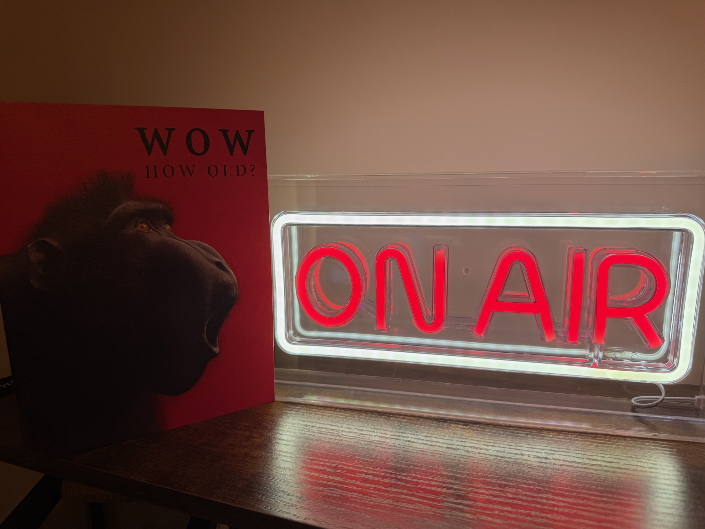

# ESP32-C6 On-Air LED Sign Firmware

Firmware for an ESP32‑C6 board (default: Seeed XIAO ESP32‑C6) that provides a captive setup portal, a small HTTP API, OTA updates, and a configurable output pin with optional breathing (PWM) mode.

This repo contains a single Arduino sketch. Prebuilt binaries are attached to each tagged [GitHub Release](https://github.com/mveplus/onair-led-sign-firmware/releases) (one per supported board).

 [On-Air Meeting Trigger Chrome extention](https://github.com/mveplus/onair-meeting-trigger/) can be used to trigger the OnAir Led/Neon Sign.



## Features

- Captive setup portal for Wi‑Fi provisioning (AP+STA).
- HTTP API to read status and control an output pin.
- OTA firmware updates at `/update` (POST/Redirect/GET, browser-back safe).
- mDNS advertising of the configured hostname.
- Two-stage factory reset via BOOT long-press: 5 s = config only, 15 s = full wipe including sticker password. Serial and HTTP fallbacks for both.
- Optional breathing output mode using PWM.
- Optional AWS IoT Core integration (MQTT cmd/state + Fleet Provisioning by Claim), credentials loaded at runtime from device NVS — no secrets in source or binaries.
- Per-device Setup-AP password + printable Wi-Fi-join QR via `scripts/print-sticker.py`.


## Project Layout

- `esp32c6-led-sign-firmware.ino` — main firmware sketch
- `API.md` — API contract and endpoints

## Hardware Defaults

- Board name: [`XIAO-ESP32-C6`](https://wiki.seeedstudio.com/xiao_esp32c6_getting_started/#hardware-overview) or [Beetle ESP32-C6](https://wiki.dfrobot.com/SKU_DFR1117_Beetle_ESP32_C6?Board%20Overview#Pin%20Diagram)
- Built‑in LED: `LED_BUILTIN` (defaults to GPIO8 if not defined by core)
- BOOT button pin: GPIO9
- Default output pin: GPIO18 (XIAO D10) — overridable at runtime via `POST /api/pin`
- LED polarity: active HIGH by default (configurable)

## Wiring Diagram (FGP30N06L, Same USB-C Supply)

Low-side switch using an N-channel MOSFET. The LED sign and ESP32‑C6 board share the same USB‑C 5V supply.

```
USB-C 5V
  +5V --------------------+---------------------+
          |                                     |
LED SIGN (+)                                 ESP32-C6 5V      
                                                |
LED SIGN (-) ----> DRAIN (FGP30N06L) SOURCE <---+---- GND (common)

ESP32-C6 GPIO (Output pin, default GPIO6)
  |
  +--[100-220R]--> GATE (FGP30N06L)
  |
 [10k]
  |
 GND
```

Notes:

- The ESP32‑C6 is 3.3V logic. FGP30N06L is suitable and enhances at 3.3V gate drive; it is a logic‑level N-Channel MOSFET.
- The gate pulldown (10k) keeps the MOSFET off during boot/reset.
- Use a small series gate resistor (100–220 ohm) to reduce ringing.
- If your LED sign is inductive, add a flyback diode across the load (anode to MOSFET drain, cathode to +5V).
- Always share ground between the board, MOSFET, and LED sign power.

## Setup Workflow (First Boot)

1. Device boots and tries saved Wi‑Fi credentials.
2. If none or connection fails, it starts a setup AP + captive portal.
3. Join the AP and configure Wi‑Fi, hostname, output pin, auth, etc.

### Setup AP & sticker

- SSID: `C6-SETUP-<MAC12>` (12 hex characters from the device MAC).
- Password format: `<word>-<word>-<word>-<4 alphanumerics>`, e.g.
  `meadow-piano-dolphin-x7k2`. ~38 bits of entropy, retypable on a phone
  keyboard if the QR scan fails.
- The password is generated once per device, stored in the `mfg` NVS
  namespace, and **persists across factory reset** so a printed sticker
  stays valid. Rotate explicitly via 15 s BOOT hold or `RESET-MFG` over
  Serial (see [Factory Reset](#factory-reset)).
- Captive portal auto-scans networks; manual / hidden SSID supported.

### Printing a Wi-Fi-join QR sticker

`scripts/print-sticker.py` opens the device's USB-CDC, queries the AP
credentials, and renders a `WIFI:T:WPA;S:...;P:...;;` QR as a PNG. Phone
cameras auto-join Wi-Fi from that QR.

```bash
# First time after flashing — fresh device, sticker reader unlocked
python3 scripts/print-sticker.py --port /dev/ttyACM0

# Already deployed (GET-STICKER locks itself on first STA join):
# rotate the AP password and re-print
python3 scripts/print-sticker.py --port /dev/ttyACM0 --reset

# Also wait for the device to join Wi-Fi and print IP + mDNS hostname
python3 scripts/print-sticker.py --port /dev/ttyACM0 --connect

# Both: rotate sticker then watch for STA join
python3 scripts/print-sticker.py --port /dev/ttyACM0 --reset --connect
```

Requires `pyserial` and `qrcode[pil]`. The device locks the sticker
read-out (`stk_lock`) on first successful STA join so a stolen, deployed
device can't divulge its setup-AP password over USB; any factory reset
that wipes `mfg` re-arms it.

### Setup AP Timeout

- Default timeout: 10 minutes.
- If still in setup mode after timeout, the device reboots and retries STA.

## Flashing Firmware

You can either flash the provided binaries from `build/` or upload a locally built sketch with [`arduino-cli`](https://github.com/arduino/arduino-cli) or [`esptool.py`](https://github.com/espressif/esptool)

### Option A: Flash a Released Binary

Tagged releases publish merged binaries per board to [GitHub Releases](https://github.com/mveplus/onair-led-sign-firmware/releases) (binaries are no longer tracked in git). Download `onair-led-sign-<board>-<version>.merged.bin` and flash:

```bash
esptool.py --chip esp32c6 --port /dev/ttyACM0 --baud 460800 \
  write_flash 0x0 onair-led-sign-xiao_esp32c6-<version>.merged.bin
```

esptool auto-enters bootloader mode via the USB-CDC bridge — no BOOT button press needed in most cases. If auto-entry fails, ground GPIO9 to GND briefly while pressing RESET, release RESET first, then release GPIO9; re-run esptool.

### Option B: Build Locally with `arduino-cli` (Docker)

```bash
./scripts/docker-build.sh                    # XIAO_ESP32C6, ENABLE_AWS_IOT=1
ENABLE_AWS_IOT=0 ./scripts/docker-build.sh   # local-only flavor

# Then write to flash:
esptool.py --chip esp32c6 --port /dev/ttyACM0 --baud 460800 \
  write_flash 0x0 build/onair-led-sign-firmware.ino.merged.bin
```

### Option C: OTA from a Reachable Device

If the device is already on your network, push a new build over the existing OTA endpoint:

```bash
./scripts/docker-build.sh
curl -u admin:esp32c6 \
  -F 'firmware=@build/onair-led-sign-firmware.ino.bin' \
  http://<device-ip>/update
```

Use the `.bin` (app partition) here, not `merged.bin`. The OTA handler 303-redirects to a "waiting for device to come back" page that polls `/api/status` and auto-navigates home when the device is back. Add `-H 'Accept: application/json'` for a JSON `{ok, rebooting}` response instead.

## Connected Mode UI

When connected to Wi‑Fi (STA):

- Root page shows status, toggle controls, breathing settings, and OTA entry.
- mDNS is advertised as `http://<hostname>.local/`.

## First Login & Token Generation

1. After the first successful STA connection, open the device UI:
   - `http://<device-ip>/` or `http://<hostname>.local/`
2. When prompted, log in with Basic Auth:
   - Default: `admin` / `esp32c6` (change in setup portal → Advanced).
3. The API token is generated automatically on that first STA connection.
4. You can view/copy the token on the connected UI page under **API access**.

## Output Control

Output modes:

- `off`
- `on`
- `breathing` (PWM; configurable period/min/max)

Breathing defaults:

- Period: 3000 ms
- Min: 5%
- Max: 100%

Allowed ranges:

- `period_ms`: 500–10000
- `min_pct`: 1–99
- `max_pct`: 1–100 (must be > min)

## Authentication

All API and OTA endpoints require auth:

- HTTP Basic Auth using configured admin user/password.
- Or API token via:
  - `X-API-Token: <token>`
  - `Authorization: Bearer <token>`
  - `?token=<token>`

Token behavior:

- Generated after the first successful STA connection.
- Stored in Preferences and displayed on the connected UI page.

Default credentials:

- Username: `admin`
- Password: `esp32c6`
- Change these in the setup portal under **Advanced** (Admin user/password fields).

## API

See `API.md` for full details.

Quick endpoints:

- `GET /api/status`
- `GET /api/set?state=0|1`
- `GET /api/mode?mode=off|on|breathing[&period_ms=...&min_pct=...&max_pct=...]`
- `GET /api/config`

### Example `curl` Commands

Replace `<ip>` with the device IP and `<token>` with your API token.

```bash
# Status
curl -H "X-API-Token: <token>" http://<ip>/api/status

# Turn output ON
curl -H "X-API-Token: <token>" "http://<ip>/api/set?state=1"

# Turn output OFF
curl -H "X-API-Token: <token>" "http://<ip>/api/set?state=0"

# Set breathing mode (3s, 5% -> 100%)
curl -H "X-API-Token: <token>" "http://<ip>/api/mode?mode=breathing&period_ms=3000&min_pct=5&max_pct=100"

# Read stored config
curl -H "X-API-Token: <token>" http://<ip>/api/config
```

## OTA Updates

- `GET /update` serves the upload form (STA mode only, auth required).
- `POST /update` accepts a compiled `.bin` (multipart form, field name
  `firmware`). On success the handler 303-redirects to `/update/done`,
  which polls `/api/status` and navigates home once the device finishes
  rebooting (~10–15 s). Browser back/refresh on the post-OTA page is safe
  — it's a plain GET, no "Confirm form resubmission" prompt.
- On failure: an inline error page (no redirect, no reboot — retry
  immediately).
- With `Accept: application/json`: returns `{ok, rebooting}` directly.
- OTA is disabled while in setup (AP) mode.

## Factory Reset

Three thresholds, depending on what you want to clear:

### 5 s BOOT — standard factory reset

Hold BOOT and release between 5 and 14 s.

- Clears: Wi-Fi creds, auth, AWS config, output settings (NVS namespace `cfg`).
- Preserves: setup-AP password and sticker lockout (NVS namespace `mfg`).
  Your printed sticker QR stays valid.
- LED: slow blink (500 ms toggle) during 0–5 s, switches to a fast blink
  (150 ms) between 5 and 15 s as a "release now to commit" cue.

### 15 s BOOT — deep factory reset

Keep holding BOOT past 15 s without releasing.

- Clears: everything above PLUS the `mfg` namespace.
- Rotates the setup-AP password; any printed sticker becomes invalid.
- LED: goes solid at the 15 s mark; reset fires immediately.

### Serial / HTTP fallbacks

Useful when the BOOT button isn't reachable or behaves badly:

```bash
# Over USB Serial (no auth)
echo 'RESET-CFG' > /dev/ttyACM0   # cfg only — equivalent to 5 s BOOT
echo 'RESET-ALL' > /dev/ttyACM0   # cfg + mfg — equivalent to 15 s BOOT
echo 'RESET-MFG' > /dev/ttyACM0   # mfg only — rotate sticker, keep config

# Over HTTP (auth required)
curl -u admin:esp32c6 -X POST http://<ip>/api/factory-reset
curl -u admin:esp32c6 -X POST 'http://<ip>/api/factory-reset?deep=1'
```

### Serial diagnostic commands

When connected over USB-CDC, 115200 baud, the device responds to a few
line-based commands. `scripts/print-sticker.py` drives the first three for
you; the reset commands are listed under "Serial fallbacks" above.

| Command | Reply | Notes |
|---|---|---|
| `GET-STICKER` | `STICKER:{mac, ssid, password, locked?}` | Read setup-AP credentials. Locks on first STA join. |
| `GET-NET`     | `NET:{mac, fw, connected, ip?, ssid?, rssi?, hostname?, mdns?, mdns_ok?}` | Current connection state. Always available. |

## Build & Flash (Arduino IDE)

1. Open `esp32c6-led-sign-firmware.ino`.
2. Select an ESP32‑C6 board (tested with XIAO ESP32‑C6).
3. Install required libraries:
   - ESPAsyncWebServer v3.9.4
   - AsyncTCP v3.4.10 (Arduino IDE built‑in via Library Manager)
   - ArduinoJson v6.x (Arduino IDE built‑in via Library Manager)
4. Compile and upload.

## Docker Build (arduino-cli)

Build binaries locally in Docker and write outputs to `build/` with SHA1 signatures.

```bash
./scripts/docker-build.sh
```

Override the board(s) if needed (comma-separated FQBNs):

```bash
FQBN=esp32:esp32:dfrobot_beetle_esp32c6,esp32:esp32:XIAO_ESP32C6 ./scripts/docker-build.sh
```

## AWS IoT Core (optional)

The firmware can keep an MQTT/TLS connection to AWS IoT Core in parallel
with the local HTTP API and captive portal. **No AWS credentials are baked
into the source or any released binary** — endpoint, root CA, per-device
cert + key, and Thing name are all loaded at runtime from the ESP32
`Preferences` namespace `aws_iot`. The module stays dormant on an
unprovisioned device.

The AWS path compiles in by default (`ENABLE_AWS_IOT=1`). To produce a
local-only firmware with the module dropped entirely:

```bash
ENABLE_AWS_IOT=0 ./scripts/docker-build.sh
```

Required library: **PubSubClient** by Nick O'Leary (auto-installed in the
Docker image; install via the Arduino Library Manager for IDE builds).

### Provisioning paths

Three options write the same NVS record `{endpoint, root_ca, thing_name,
cert, key}`. The captive portal's connected-page UI offers the first two:

1. **Paste credentials** — `POST /api/aws/provision` or the captive portal
   "AWS IoT" form. You generate the per-device cert with `aws iot
   create-keys-and-certificate` and paste it once. Zero AWS-side setup.
2. **Fleet Provisioning by Claim** — `POST /api/aws/claim` or the captive
   portal "Fleet Provisioning by Claim" form. Device runs the standard AWS
   provisioning MQTT exchange against a user-supplied claim cert + template
   name; the claim cert is consumed once and never persisted.
3. **Custom backend** — contract documented in
   [docs/bootstrap-backend.md](docs/bootstrap-backend.md). Device-side
   wiring deferred past v1.

### Trust anchor

Amazon Root CA 1 is bundled in firmware (it is a public certificate).
Override at runtime via the `root_ca` field in the provisioning JSON if
AWS rotates to CA 3/4 or if you need a custom CA.

### Topics

| Topic | Direction | Payload |
| --- | --- | --- |
| `onair/<thing>/state` | device → cloud | `{"mode":0\|1\|2,"thing":"...","uptime_ms":...,"rssi":...}` — published on every `setOutputMode()` and on every (re)connect |
| `onair/<thing>/cmd`   | cloud → device | `{"mode":0\|1\|2}` — applied via `setOutputMode()` |

### Endpoints

All AWS endpoints require auth; see `API.md` for full details.

- `POST /api/aws/provision` — write config to NVS, re-init module
- `POST /api/aws/claim` — run Fleet Provisioning by Claim (synchronous ~10–30 s)
- `GET  /api/aws/status` — `{provisioned, connected, last_rc, thing, endpoint}` (never echoes PEM bytes)
- `POST /api/aws/forget` — clear the NVS record, disconnect

### Verifying from the AWS console

1. Provision the device via one of the paths above.
2. Open **AWS IoT → Test → MQTT test client**.
3. Subscribe to `onair/#`.
4. The device publishes a `state` message a few seconds after the MQTT
   connect.
5. Publish `{"mode":1}` to `onair/<thing>/cmd` to turn the output on
   (`0` / `2` for off / breathing). A fresh `state` message is published
   in response.

## Optional BLE Provisioning

BLE provisioning is compile‑time gated:

- Set `ENABLE_BLE_PROV` to `1`.
- Requires `WiFiProv.h` availability in your core/toolchain.
- AP portal remains the primary provisioning path.

## Notes / Troubleshooting

- If the output pin is set to the built‑in LED, the LED polarity setting matters.
- PWM breathing requires a PWM‑capable GPIO.
- If you see “OTA disabled in setup mode”, connect the device to Wi‑Fi first.
